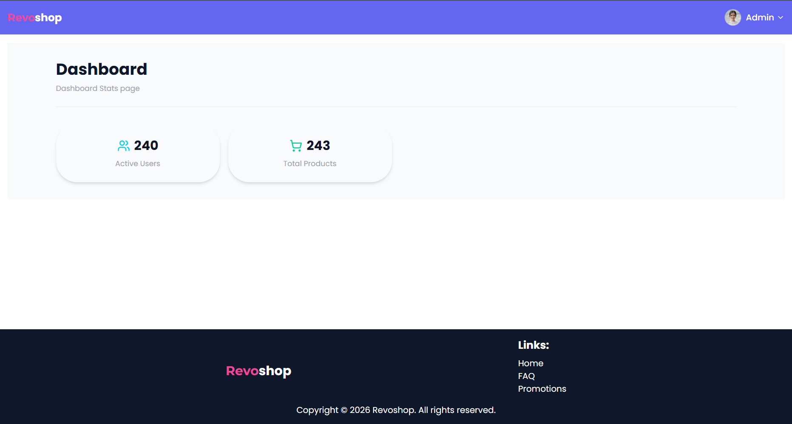
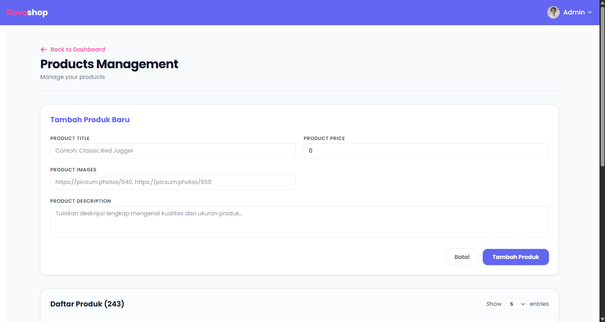
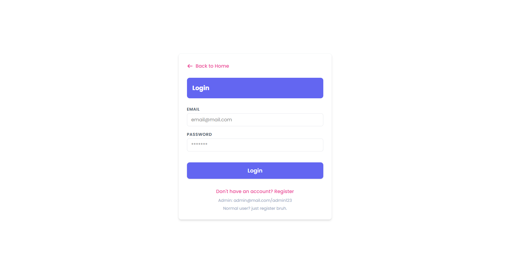
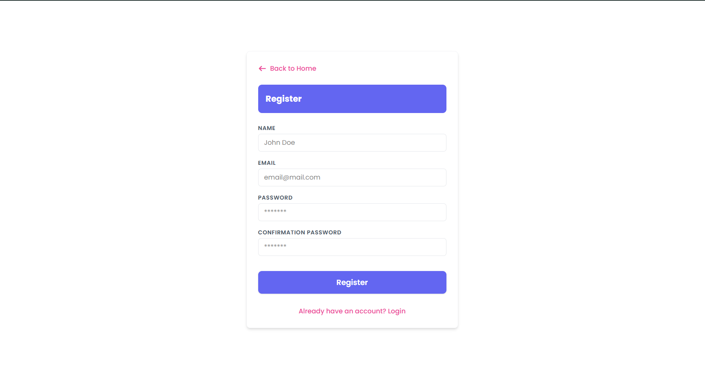

[](https://classroom.github.com/a/FR3B1BQd)

# 👁️ Overview

Revoshop is a web application that sell many product in online store. This website build for assignment milestone 3 of Revou FSSE.
Built with Next.js, Tailwind CSS, and Platzi for manage product data and auth system. Also use Bun for faster development and deployment. 


# How to run

```bash
bun install
bun dev
```

## 📃 Github Pages

### Preview Web: [Click here!](https://milestone-3-diba15.vercel.app/)

---

## 📋 Features

| Feature                    | Description                                |
| -------------------------- | ------------------------------------------ |
| Add to cart                | Add products to the shopping cart          |
| Decrease item quantity     | Decrease the quantity of items in the cart |
| Checkout                   | Checkout the items in the cart             |
| Clear cart                 | Clear all items in the cart                |
| Remove item                | Remove an item from the cart               |
| Notification Toast & Modal | Notification for user with Toast & Modal   |
| Search product             | Search product by name & Categories        |
| Auth system with role      | Auth system with role admin & user         |
| Management Product         | Management product by admin                |

---

## 🛠️ Tech Stack

[](https://skillicons.dev)

- Next JS: Used for building the web application.
- Tailwind CSS: Used for styling the resume and making it visually appealing.
- Typescript: Used for adding interactivity, such as click navbar.
- Bun: Used for building the web application.
- Fakestore API Platzi: Used for manage product data and auth system.

## 📸 Screenshots

| Image                                                              | Description        |
| ------------------------------------------------------------------ | ------------------ |
|            | Homepage           |
|          | Detail Product     |
|             | FAQ                |
|            | Cart               |
|      | Promotion          |
|       | Dashboard          |
|  | Management Product |
|           | Login              |
|        | Register           |

## 📂 Project Structure

```bash
milestone-3-Diba15/
├── node_modules/           # Folder dependencies (otomatis dibuat oleh bun install)
├── public/                 # File statis (gambar, favicon, font)
├── src/
│   ├── api/                  # Folder untuk konfigurasi API / Fetcher
│   ├── app/
│   │   ├── (auth)/           # Route Group untuk Autentikasi
│   │   │   ├── layout.tsx    # Layout untuk halaman autentikasi
│   │   │   ├── page.tsx
│   │   │   ├── login/        # Route: /login
│   │   │   │   └── page.tsx
│   │   │   └── register/
│   │   │       └── page.tsx  # Route: /register
│   │   ├── (main)/           # Route Group untuk Halaman Utama/Publik
│   │   │   ├── layout.tsx    # Layout untuk halaman utama
│   │   │   ├── page.tsx
│   │   │   ├── cart/         # Route: /cart (di gambar masih kosong, tambahkan page.tsx jika ingin diakses)
│   │   │   ├── faq/          # Route: /faq
│   │   │   │   └── page.tsx
│   │   │   ├── product/      
│   │   │   │   └── [id]/     
│   │   │   │       └── page.tsx
│   │   │   └── promotions/   # Route: /promotions
│   │   │       └── page.tsx  # Halaman utama promosi (/promotions)
│   │   ├── dashboard/        # Route: /dashboard
│   │   │   ├── page.tsx      # Halaman utama dashboard
│   │   │   ├── layout.tsx
│   │   │   └── products/     # Route: /dashboard/products
│   │   │       └── page.tsx  
│   │   ├── favicon.ico
│   │   ├── globals.css
│   │   ├── layout.tsx        # Root Layout utama aplikasi
│   │   └── not-found.tsx     # Halaman 404
│   ├── components/           # Komponen reusable
│   ├── context/              # State management (React Context)
│   ├── data/                 # Dummy data / konstanta
│   ├── types/                # TypeScript Types/Interfaces
│   ├── utils/                # Helper / Utility functions
│   └── proxy.ts              # File middleware pada next js untuk authentikasi
├── .gitignore
├── next.config.ts          # Konfigurasi Next.js
├── bun.lock                # Konfigurasi Bun
├── eslint.config.mjs       # Konfigurasi ESLint
├── package.json
├── postcss.config.mjs      # Konfigurasi PostCSS (jika pakai Tailwind)
└── tsconfig.json           # Konfigurasi TypeScript
```
