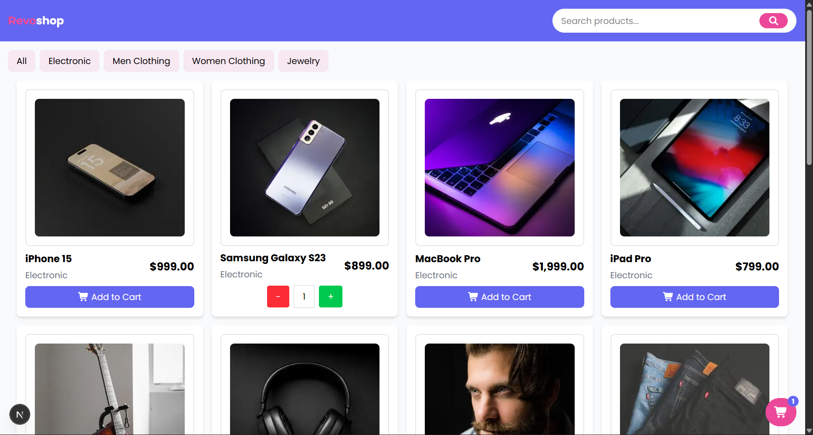
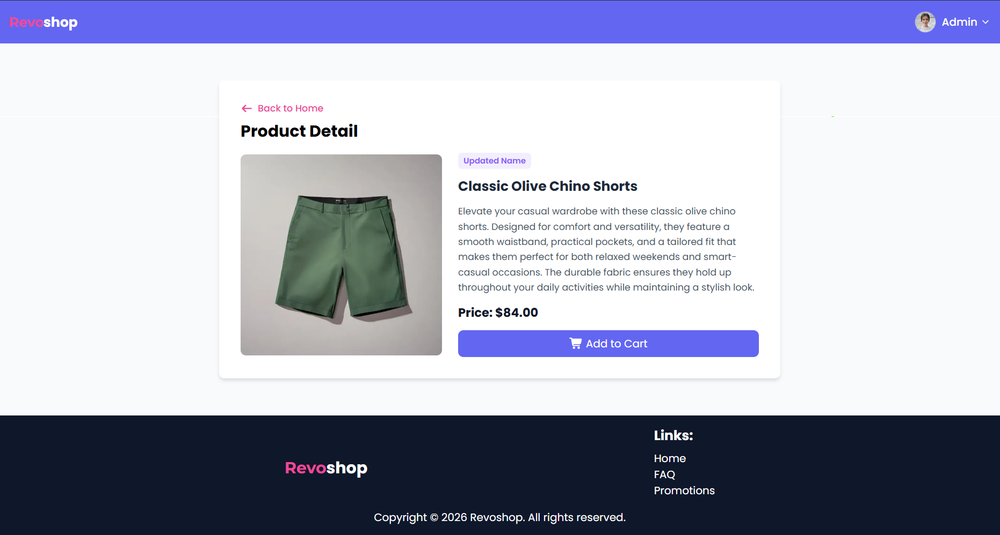
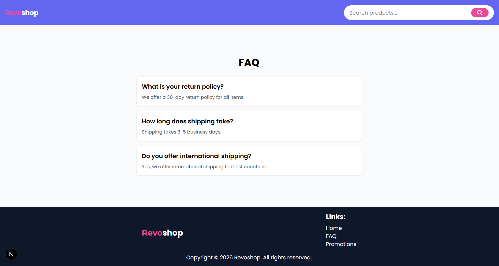
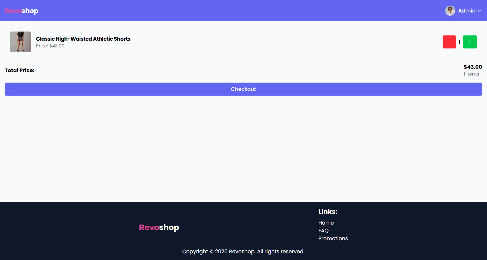
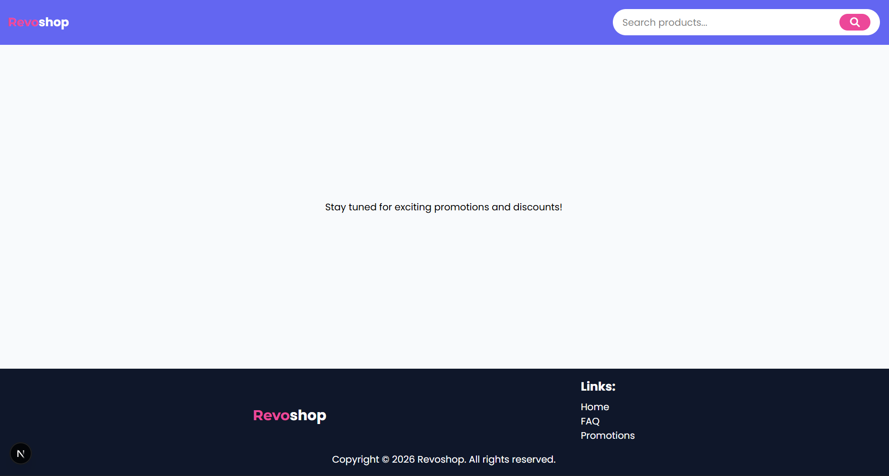

[](https://classroom.github.com/a/FR3B1BQd)

# 👁️ Overview

Revoshop is a web application that sell many product in online store. It is built using Next.js, TypeScript, and Tailwind CSS.

# How to run

```bash
bun install
bun dev
```

## 📃 Github Pages

### Preview Web: [Click here!](https://milestone-3-diba15.vercel.app/)

---

## 📋 Features

| Feature                | Description                                |
|------------------------|--------------------------------------------|
| Add to cart            | Add products to the shopping cart          |
| Decrease item quantity | Decrease the quantity of items in the cart |
| Checkout               | Checkout the items in the cart             |
| Clear cart             | Clear all items in the cart                |
| Remove item            | Remove an item from the cart               |

---

## 🛠️ Tech Stack

[](https://skillicons.dev)

- Next JS: Used for building the web application.
- Tailwind CSS: Used for styling the resume and making it visually appealing.
- Typescript: Used for adding interactivity, such as click navbar.

## 📸 Screenshots

| Image                                                          | Description    |
|----------------------------------------------------------------|----------------|
|        | Homepage       | 
|      | Detail Product |
|         | FAQ            |
|        | Cart           |
|  | Promotion      |

## 📂 Project Structure

```bash
milestone-3-Diba15/
├── node_modules/           # Folder dependencies (otomatis dibuat oleh bun install)
├── public/                 # File statis (gambar, favicon, font)
├── src/                    # (Opsional tapi direkomendasikan) Folder source utama
│   ├── app/                # Kunci utama routing dan halaman
│   │   ├── layout.js       # Root Layout (Wajib)
│   │   ├── page.js         # Halaman Utama (/)
│   │   ├── global.css      # Global styles
│   │   ├── cart/            # Route: /cart
│   │   │   └── page.js
│   │   ├── faq/            # Route: /faq
│   │   │   └── page.js
│   │   ├── product/            # Route: /product/[id]
│   │   │   ├── [id]
│   │   │   │   └── page.js
│   │   └── promotions/      # Route: /promotions
│   │       └── page.js
│   ├── components/         # Komponen reusable (Button, Navbar, Footer)
│   ├── context/            # Berisi konteks (CartContext)
│   ├── data/               # Berisi dummy data aplikasi
│   └── types/              # Berisi type data aplikasi
├── .gitignore
├── next.config.ts          # Konfigurasi Next.js
├── bun.lock                # Konfigurasi Bun
├── eslint.config.mjs       # Konfigurasi ESLint
├── package.json
├── postcss.config.mjs      # Konfigurasi PostCSS (jika pakai Tailwind)
└── tsconfig.json           # Konfigurasi TypeScript
```
